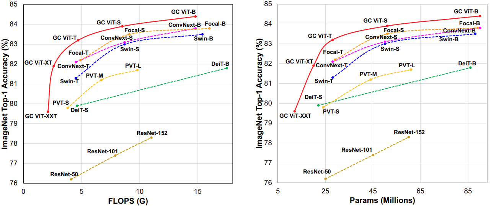

# Global Context Vision Transformer (GC ViT)

This repository is the official PyTorch implementation of **Global Context Vision Transformers**. \
 \
[Global Context Vision
Transformers](https://arxiv.org/pdf/2206.09959.pdf) \
[Ali Hatamizadeh](https://research.nvidia.com/person/ali-hatamizadeh),
[Hongxu (Danny) Yin](https://scholar.princeton.edu/hongxu), [Jan Kautz](https://jankautz.com/), 
and [Pavlo Molchanov](https://www.pmolchanov.com/).

GC ViT  achieves state-of-the-art results across image classification, object detection and semantic segmentation tasks. On ImageNet-1K dataset for classification, the tiny, small, base and large variants of GC ViT with `28M`, `51M`, `90M` and `201M` parameters achieve `83.4`, `83.9`, `84.5` and `84.8` Top-1 accuracy, respectively, surpassing comparably-sized prior art such as CNN-based ConvNeXt and ViT-based Swin Transformer by a large margin. Pre-trained GC ViT backbones in downstream tasks of object detection, instance segmentation, 
and semantic segmentation using MS COCO and ADE20K datasets outperform prior work consistently, sometimes by large margins.



The architecture of GC ViT is demonstrated in the following:


## Updates

***01/12/2023***

1. Updated pre-trained weights for GC ViT Large model. Please see below for download link.

2. ImageNet-v2 benchmarks released for all GC ViT models.

***11/15/2022***

1. Pre-trained weights for GC ViT Large model are released. Please see below for download link.  


***08/28/2022***

1. GC ViT and its pre-trained weights are now available as part of [timm](https://github.com/rwightman/pytorch-image-models) library. 

***08/11/2022***

1. New Pre-trained model weights with improved performance have been released. Please see below for download link. 
2. GC ViT model has been updated with enhanced global query generator.
 
***06/23/2022***

1. Pre-trained model weights released. Please see below for download link. 

***06/17/2022***

1. GC ViT model, training and validation scripts released for ImageNet-1K classification.
2. Pre-trained model checkpoints will be released soon. 

## Introduction

**GC ViT** leverages global context self-attention modules, joint with local self-attention, to effectively yet efficiently model both long and short-range spatial interactions, without the need for expensive 
operations such as computing attention masks or shifting local windows.


## ImageNet Benchmarks

**ImageNet-1K Pretrained Models**

<table>
  <tr>
    <th>Name</th>
    <th>Acc@1</th>
    <th>Acc@5</th>
    <th>Resolution</th>
    <th>#Params</th>
    <th>FLOPs</th>
    <th>Summary</th>
    <th>Download </th>
  </tr>
<tr>
    <td>GC ViT-XXT</td>
    <td>79.8</td>
    <td>95.1</td>
    <td>224x224</td>
    <td>12</td>
    <td>2.1</td>
    <td><a href="https://drive.google.com/file/d/1-xVff6ZCEyIHwo4oCk1DqSEOsc2Pu6ju/view?usp=sharing">summary</a></td>
    <td><a href="https://drive.google.com/file/d/1Bfe63cGurkufL0mEUL05oposybbPnAom/view?usp=sharing">model</a></td>
</tr>
<tr>
    <td>GC ViT-XT</td>
    <td>82.0</td>
    <td>96.0</td>
    <td>224x224</td>
    <td>20</td>
    <td>2.6</td>
    <td><a href="https://drive.google.com/file/d/1Ge_F6n80AiMtCHgMqdoSVm90sQ6WCGTh/view?usp=sharing">summary</a></td>
    <td><a href="https://drive.google.com/file/d/15kt8VOXdAH_jF77g7pEPk-ZmZF13sHRd/view?usp=sharing">model</a></td>
</tr>
<tr>
    <td>GC ViT-T</td>
    <td>83.4</td>
    <td>96.4</td>
    <td>224x224</td>
    <td>28</td>
    <td>4.7</td>
    <td><a href="https://drive.google.com/file/d/1ApoKxz553aZl4Yr0tIgu32qgXJiOKYiI/view?usp=sharing">summary</a></td>
    <td><a href="https://drive.google.com/file/d/1C9lLgykooDF6CxZDFDnUqw5lEqoFgULh/view?usp=sharing">model</a></td>
</tr>

<tr>
    <td>GC ViT-S</td>
    <td>83.9</td>
    <td>96.6</td>
    <td>224x224</td>
    <td>51</td>
    <td>8.5</td>
    <td><a href="https://drive.google.com/file/d/1CTpcbHhNxXeIG4-cp3TWV7TqCeGmcVlg/view?usp=sharing">summary</a></td>
    <td><a href="https://drive.google.com/file/d/1bfEJQNutyDkPHAkgYcKWhjVTT_ZnYXp4/view?usp=sharing">model</a></td>
</tr>

<tr>
    <td>GC ViT-B</td>
    <td>84.5</td>
    <td>96.8</td>
    <td>224x224</td>
    <td>90</td>
    <td>14.8</td>
    <td><a href="https://drive.google.com/file/d/1yAJeyMf8a1M2oc3aGP8qwNBz1NTDNuGP/view?usp=sharing">summary</a></td>
    <td><a href="https://drive.google.com/file/d/1PFugO7dqfS-eubZi-yksM_FcYvUNjXBn/view?usp=sharing">model</a></td>
</tr>

<tr>
    <td>GC ViT-L</td>
    <td>84.8</td>
    <td>97.1</td>
    <td>224x224</td>
    <td>201</td>
    <td>32.6</td>
    <td><a href="https://drive.google.com/file/d/18F1yt-qLw9dG_hoLXsLFEjgtGzF3-Pzv/view?usp=share_link">summary</a></td>
    <td><a href="https://drive.google.com/file/d/1zPOHZYdSyak03X9mfX_4QV_wYR4cspOH/view?usp=sharing">model</a></td>
</tr>

</table>


## ImageNet-v2 Benchmarks

<table>
  <tr>
    <th>Name</th>
    <th>Acc@1-ImageNet-v2</th>
    <th>Acc@1-ImageNet-1K</th>
    <th>Resolution</th>
  </tr>
<tr>
    <td>GC ViT-XXT</td>
    <td>69.3</td>
    <td>79.8</td>
    <td>224x224</td>
</tr>
<tr>
    <td>GC ViT-XT</td>
    <td>71.3</td>
    <td>82.0</td>
    <td>224x224</td>
</tr>
<tr>
    <td>GC ViT-T</td>
    <td>73.1</td>
    <td>83.4</td>
    <td>224x224</td>
</tr>
<tr>
    <td>GC ViT-S</td>
    <td>73.8</td>
    <td>83.9</td>
    <td>224x224</td>
</tr>
<tr>
    <td>GC ViT-B</td>
    <td>74.4</td>
    <td>84.5</td>
    <td>224x224</td>
</tr>
    <td>GC ViT-L</td>
    <td>74.9</td>
    <td>84.8</td>
    <td>224x224</td>
</table>


## Installation

This repository is compatible with NVIDIA PyTorch docker `nvcr>=21.06` which can be obtained in this 
[link](https://catalog.ngc.nvidia.com/orgs/nvidia/containers/pytorch).

The dependencies can be installed by running:

```bash
pip install -r requirements.txt
```

## Data Preparation

Please download the ImageNet dataset from its official website. The training and validation images need to have
sub-folders for each class with the following structure:

```bash
  imagenet
  ├── train
  │   ├── class1
  │   │   ├── img1.jpeg
  │   │   ├── img2.jpeg
  │   │   └── ...
  │   ├── class2
  │   │   ├── img3.jpeg
  │   │   └── ...
  │   └── ...
  └── val
      ├── class1
      │   ├── img4.jpeg
      │   ├── img5.jpeg
      │   └── ...
      ├── class2
      │   ├── img6.jpeg
      │   └── ...
      └── ...
 
  ```

## Commands

### Training on ImageNet-1K From Scratch (Multi-GPU)

The `GC ViT` model can be trained from scratch on ImageNet-1K dataset by running:

```bash
python -m torch.distributed.launch --nproc_per_node <num-of-gpus> --master_port 11223  train.py \ 
--config <config-file> --data_dir <imagenet-path> --batch-size --amp <batch-size-per-gpu> --tag <run-tag> --model-ema
```

To resume training from a pre-trained checkpoint:

```bash
python -m torch.distributed.launch --nproc_per_node <num-of-gpus> --master_port 11223  train.py \ 
--resume <checkpoint-path> --config <config-file> --amp --data_dir <imagenet-path> --batch-size <batch-size-per-gpu> --tag <run-tag> --model-ema
```

### Evaluation

To evaluate a pre-trained checkpoint using ImageNet-1K validation set on a single GPU:

```bash
python validate.py --model <model-name> --checkpoint <checkpoint-path> --data_dir <imagenet-path> --batch-size <batch-size-per-gpu>
```

## Citation

Please consider citing GC ViT paper if it is useful for your work:

```
@article{hatamizadeh2022global,
  title={Global Context Vision Transformers},
  author={Hatamizadeh, Ali and Yin, Hongxu and Kautz, Jan and Molchanov, Pavlo},
  journal={arXiv preprint arXiv:2206.09959},
  year={2022}
}
```

## Third-party Implementations and Resources

In this section, we list third-party contributions by other users. If you would like to have your work included here, please
raise an issue in this repository.

| Name | Link | Contributor | Note
|:---:|:---:|:---:|:---------:|
|timm|[Link](https://github.com/rwightman/pytorch-image-models)| @rwightman | PyTorch
|tfgcvit|[Link](https://github.com/shkarupa-alex/tfgcvit)| @shkarupa-alex | Tensorflow 2.0 (Keras)
|gcvit-tf|[Link](https://github.com/awsaf49/gcvit-tf)| @awsaf49 | Tensorflow 2.0 (Keras)
|GCViT-TensorFlow|[Link](https://github.com/EMalagoli92/GCViT-TensorFlow)| @EMalagoli92 | Tensorflow 2.0 (Keras)
|keras_cv_attention_models|[Link](https://github.com/leondgarse/keras_cv_attention_models/tree/main/keras_cv_attention_models/gcvit)| @leondgarse | Keras
|Paper Explanation|[Link](https://www.kaggle.com/code/awsaf49/guie-global-context-vit-gcvit)| @awsaf49 | Annotated GC ViT
|Colab Notebook|[Link](https://colab.research.google.com/github/awsaf49/gcvit-tf/blob/main/notebooks/GCViT_Flower_Classification.ipynb)| @awsaf49 | Flower classification
|Kaggle Notebook|[Link](https://www.kaggle.com/code/awsaf49/flower-classification-gcvit-global-context-vit/notebook)| @awsaf49 | Flower classification
|Live Demo|[Link](https://huggingface.co/spaces/awsaf49/gcvit-tf)| @awsaf49 | Hugging Face demo


## Acknowledgement

- This repository is built upon the [timm](https://github.com/rwightman/pytorch-image-models) library. 

- We would like to sincerely thank the community especially Github users @rwightman, @shkarupa-alex, @awsaf49, @leondgarse, who have provided insightful feedback, which has helped us to further improve GC ViT and achieve even better benchmarks.


## Licenses

Copyright © 2022, NVIDIA Corporation. All rights reserved.

This work is made available under the Nvidia Source Code License-NC. Click [here](LICENSE) to view a copy of this license.

The pre-trained models are shared under [CC-BY-NC-SA-4.0](https://creativecommons.org/licenses/by-nc-sa/4.0/). If you remix, transform, or build upon the material, you must distribute your contributions under the same license as the original.

For license information regarding the timm repository, please refer to its [official website](https://github.com/rwightman/pytorch-image-models).

For license information regarding the ImageNet dataset, please refer to its [official website](https://www.image-net.org/). 
