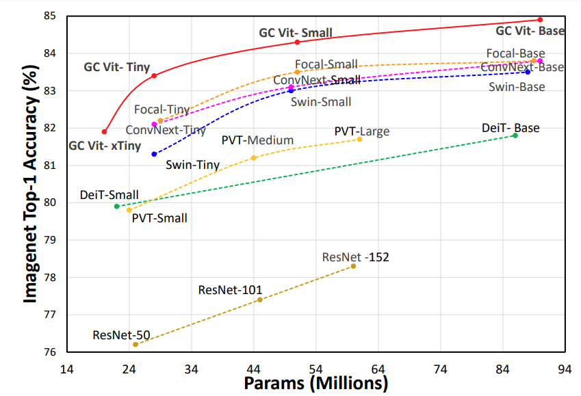
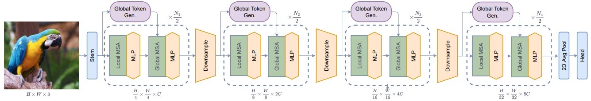
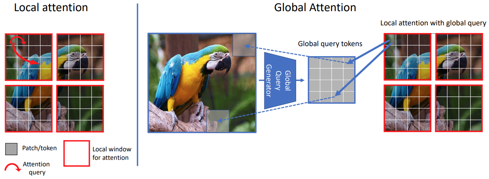

# Global Context Vision Transformer (GC ViT)

This repository presents the official PyTorch implementation of **Global Context Vision Transformers** (ICML2023) \
 \
[Global Context Vision
Transformers](https://arxiv.org/pdf/2206.09959.pdf) \
[Ali Hatamizadeh](https://research.nvidia.com/person/ali-hatamizadeh),
[Hongxu (Danny) Yin](https://scholar.princeton.edu/hongxu),
[Greg Heinrich](https://developer.nvidia.com/blog/author/gheinrich/),
[Jan Kautz](https://jankautz.com/), 
and [Pavlo Molchanov](https://www.pmolchanov.com/).

GC ViT  achieves state-of-the-art results across image classification, object detection and semantic segmentation tasks. On ImageNet-1K dataset for classification, GC ViT variants with `51M`, `90M` and `201M` parameters achieve `84.3`, `85.9` and `85.7` Top-1 accuracy, respectively, surpassing comparably-sized prior art such as CNN-based ConvNeXt and ViT-based Swin Transformer.

<!--  -->

The architecture of GC ViT is demonstrated in the following:



## 💥 News 💥

- **[05.21.2023]** 🔥🔥 We have released ImageNet-21K fine-tuned GC ViT model weights for 224x224 and 384x384.
- **[05.21.2023]** 🔥🔥 We have released new ImageNet-1K GC ViT model weights with **better performance** !
- **[04.24.2023]** 🔥🔥🔥 GC ViT has been accepted to **ICML 2023** !


## Introduction

**GC ViT** leverages global context self-attention modules, joint with local self-attention, to effectively yet efficiently model both long and short-range spatial interactions, without the need for expensive 
operations such as computing attention masks or shifting local windows.



## ImageNet Benchmarks


**ImageNet-1K Pretrained Models**

<table>
  <tr>
    <th>Model Variant</th>
    <th>Acc@1</th>
    <th>#Params(M)</th>
    <th>FLOPs(G)</th>
    <th>Download</th>
  </tr>
<tr>
    <td>GC ViT-XXT</td>
    <th>79.9</th>
    <td>12</td>
    <td>2.1</td>
    <td><a href="https://drive.google.com/uc?export=download&id=1apSIWQCa5VhWLJws8ugMTuyKzyayw4Eh">model</a></td>
</tr>
<tr>
    <td>GC ViT-XT</td>
    <th>82.0</th>
    <td>20</td>
    <td>2.6</td>
    <td><a href="https://drive.google.com/uc?export=download&id=1OgSbX73AXmE0beStoJf2Jtda1yin9t9m">model</a></td>
</tr>
<tr>
    <td>GC ViT-T</td>
    <th>83.5</th>
    <td>28</td>
    <td>4.7</td>
    <td><a href="https://drive.google.com/uc?export=download&id=11M6AsxKLhfOpD12Nm_c7lOvIIAn9cljy">model</a></td>
</tr>
<tr>
    <td>GC ViT-T2</td>
    <th>83.7</th>
    <td>34</td>
    <td>5.5</td>
    <td><a href="https://drive.google.com/uc?export=download&id=1cTD8VemWFiwAx0FB9cRMT-P4vRuylvmQ">model</a></td>
</tr>
<tr>
    <td>GC ViT-S</td>
    <th>84.3</th>
    <td>51</td>
    <td>8.5</td>
    <td><a href="https://drive.google.com/uc?export=download&id=1Nn6ABKmYjylyWC0I41Q3oExrn4fTzO9Y">model</a></td>
</tr>
<tr>
    <td>GC ViT-S2</td>
    <th>84.8</th>
    <td>68</td>
    <td>10.7</td>
    <td><a href="https://drive.google.com/uc?export=download&id=1E5TtYpTqILznjBLLBTlO5CGq343RbEan">model</a></td>
</tr>
<tr>
    <td>GC ViT-B</td>
    <th>85.0</th>
    <td>90</td>
    <td>14.8</td>
    <td><a href="https://drive.google.com/uc?export=download&id=1PF7qfxKLcv_ASOMetDP75n8lC50gaqyH">model</a></td>
</tr>

<tr>
    <td>GC ViT-L</td>
    <th>85.7</th>
    <td>201</td>
    <td>32.6</td>
    <td><a href="https://drive.google.com/uc?export=download&id=1Lkz1nWKTwCCUR7yQJM6zu_xwN1TR0mxS">model</a></td>
</tr>

</table>


**ImageNet-21K Pretrained Models**

<table>
  <tr>
    <th>Model Variant</th>
    <th>Resolution</th>
    <th>Acc@1</th>
    <th>#Params(M)</th>
    <th>FLOPs(G)</th>
    <th>Download</th>
  </tr>
<tr>
    <td>GC ViT-L</td>
    <td>224 x 224</td>
    <th>86.6</th>
    <td>201</td>
    <td>32.6</td>
    <td><a href="https://drive.google.com/uc?export=download&id=1maGDr6mJkLyRTUkspMzCgSlhDzNRFGEf">model</a></td>
</tr>
<tr>
    <td>GC ViT-L</td>
    <td>384 x 384</td>
    <th>87.4</th>
    <td>201</td>
    <td>120.4</td>
    <td><a href="https://drive.google.com/uc?export=download&id=1P-IEhvQbJ3FjnunVkM1Z9dEpKw-tsuWv">model</a></td>
</tr>

</table>


## Installation

The dependencies can be installed by running:

```bash
pip install -r requirements.txt
```

## Data Preparation

Please download the ImageNet dataset from its official website. The training and validation images need to have
sub-folders for each class with the following structure:

```bash
  imagenet
  ├── train
  │   ├── class1
  │   │   ├── img1.jpeg
  │   │   ├── img2.jpeg
  │   │   └── ...
  │   ├── class2
  │   │   ├── img3.jpeg
  │   │   └── ...
  │   └── ...
  └── val
      ├── class1
      │   ├── img4.jpeg
      │   ├── img5.jpeg
      │   └── ...
      ├── class2
      │   ├── img6.jpeg
      │   └── ...
      └── ...
 
  ```

## Commands

### Training on ImageNet-1K From Scratch (Multi-GPU)

The `GC ViT` model can be trained from scratch on ImageNet-1K dataset by running:

```bash
python -m torch.distributed.launch --nproc_per_node <num-of-gpus> --master_port 11223  train.py \ 
--config <config-file> --data_dir <imagenet-path> --batch-size --amp <batch-size-per-gpu> --tag <run-tag> --model-ema
```

To resume training from a pre-trained checkpoint:

```bash
python -m torch.distributed.launch --nproc_per_node <num-of-gpus> --master_port 11223  train.py \ 
--resume <checkpoint-path> --config <config-file> --amp --data_dir <imagenet-path> --batch-size <batch-size-per-gpu> --tag <run-tag> --model-ema
```

### Evaluation

To evaluate a pre-trained checkpoint using ImageNet-1K validation set on a single GPU:

```bash
python validate.py --model <model-name> --checkpoint <checkpoint-path> --data_dir <imagenet-path> --batch-size <batch-size-per-gpu>
```

## Citation

Please consider citing GC ViT paper if it is useful for your work:

```
@article{hatamizadeh2023global,
  title={Global Context Vision Transformers},
  author={Hatamizadeh, Ali and Yin, Hongxu and Heinrich, Greg and Kautz, Jan and Molchanov, Pavlo},
  journal={arXiv preprint arXiv:2206.09959},
  year={2023}
}
```

## Third-party Implementations and Resources

In this section, we list third-party contributions by other users. If you would like to have your work included here, please
raise an issue in this repository.

| Name | Link | Contributor | Framework
|:---:|:---:|:---:|:---------:|
|timm|[Link](https://github.com/rwightman/pytorch-image-models)| @rwightman | PyTorch
|tfgcvit|[Link](https://github.com/shkarupa-alex/tfgcvit)| @shkarupa-alex | Tensorflow 2.0 (Keras)
|gcvit-tf|[Link](https://github.com/awsaf49/gcvit-tf)| @awsaf49 | Tensorflow 2.0 (Keras)
|GCViT-TensorFlow|[Link](https://github.com/EMalagoli92/GCViT-TensorFlow)| @EMalagoli92 | Tensorflow 2.0 (Keras)
|keras_cv_attention_models|[Link](https://github.com/leondgarse/keras_cv_attention_models/tree/main/keras_cv_attention_models/gcvit)| @leondgarse | Keras
|flaim|[Link](https://github.com/BobMcDear/flaim)| @BobMcDear | JAX/Flax

## Additional Resources

We list additional GC ViT resources such as notebooks, demos, paper explanations in this section. If you have created similar items and would like to be included, please raise an issue in this repository.

| Name | Link | Contributor | Note
|:---:|:---:|:---:|:---------:|
|Paper Explanation|[Link](https://www.kaggle.com/code/awsaf49/guie-global-context-vit-gcvit)| @awsaf49 | Annotated GC ViT
|Colab Notebook|[Link](https://colab.research.google.com/github/awsaf49/gcvit-tf/blob/main/notebooks/GCViT_Flower_Classification.ipynb)| @awsaf49 | Flower classification
|Kaggle Notebook|[Link](https://www.kaggle.com/code/awsaf49/flower-classification-gcvit-global-context-vit/notebook)| @awsaf49 | Flower classification
|Live Demo|[Link](https://huggingface.co/spaces/awsaf49/gcvit-tf)| @awsaf49 | Hugging Face demo


## Acknowledgement

- This repository is built upon the [timm](https://github.com/rwightman/pytorch-image-models) library. 

- We would like to sincerely thank the community especially Github users @rwightman, @shkarupa-alex, @awsaf49, @leondgarse, who have provided insightful feedback, which has helped us to further improve GC ViT and achieve even better benchmarks.


## Licenses

Copyright © 2023, NVIDIA Corporation. All rights reserved.

This work is made available under the Nvidia Source Code License-NC. Click [here](LICENSE) to view a copy of this license.

The pre-trained models are shared under [CC-BY-NC-SA-4.0](https://creativecommons.org/licenses/by-nc-sa/4.0/). If you remix, transform, or build upon the material, you must distribute your contributions under the same license as the original.

For license information regarding the timm repository, please refer to its [official website](https://github.com/rwightman/pytorch-image-models).

For license information regarding the ImageNet dataset, please refer to its [official website](https://www.image-net.org/). 
